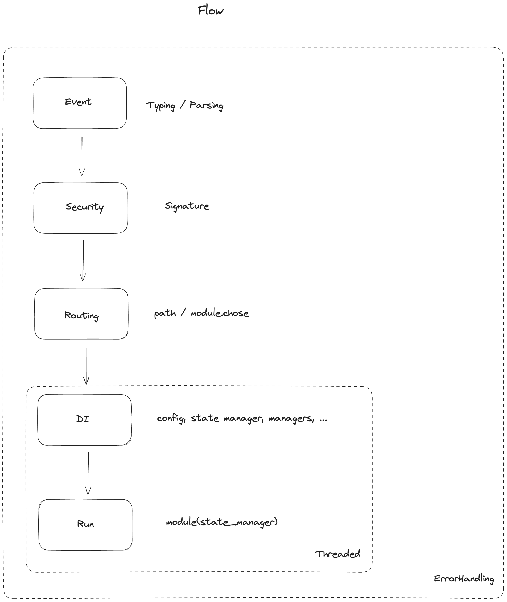

# App

`App` exposes ways to customize handling of the external module.

## Structure


## Flow



## StateManager

`StateManager` is a class that manages the state of the external module.
It exposes all the library features to interact with Unique APIs.

You can extend the `StateManager` and add your own methods to it before registering it to your app.

```python

class MyStateManager(StateManager):

  def howdy(self):
    self.messages.create(
      Message.SYSTEM(
        "Howdy!"
      )
    )

app = App("MyExternalModule").managed(MyStateManager).of(module)
```

You should also update your module signature to reflect the new state manager and leverage linting.

```python

def module(state: MyStateManager) -> bool:
    state.howdy()
    return True
```

## ModuleConfig

`ModuleConfig` contains properties set at the Space level in the Unique chat UI.

You can structure specific configurations for your external module.

Extend the `ModuleConfig` class and add your own properties to it before registering it to your app.

```python

class MyModuleConfig(ModuleConfig):

  MY_CONFIG: str = "my_config"

app = App("MyExternalModule").configured(MyModuleConfig).of(module)
```

You should also update your module signature to reflect the new module config and leverage linting.

```python

def module(state: StateManager[MyModuleConfig]) -> bool:
    print(state.conf.MY_CONFIG)
    return True
```

## Threading

You can disable threading for your external module.

```python
app = App("MyExternalModule").threaded(False).of(module)
```
## Customizing Error Handling in the Library

This library provides flexible mechanisms to customize error handling. By following the steps below, you can define custom behavior for handling exceptions within your application.

### Step-by-Step Guide to Custom Error Handling

1. **Define Custom Exception Classes:**
   Create your own exception classes by inheriting from Python's built-in `Exception` class. You can add custom methods to these classes to specify how the exceptions should be handled.

   ```python
   class CustomException(Exception):
       def handle(self, state: StateManager[UploadConfig]):
           print(f"Custom exception handled! {state.messages.last()}")
   ```

2. **Define Exception Handling Functions:**
   Write functions that handle specific exceptions. These functions should accept the exception object and the current state manager as parameters.

   ```python
   def handle_exceptions(e: KeyError, state: StateManager[UploadConfig]):
       print(f"Exception handled! {state.messages.last()}")
   ```

3. **Extend the App Class for Custom Exception Handling:**
   Extend the provided `App` class and override the `root_exception_handler` method. This method will be called if no custom handler is found for a specific exception.

   ```python
   class CustomApp(App):

       def root_exception_handler(
           self, e: Exception, state: StateManager[UploadConfig]
       ):
           print(f"Exception handled! {state.messages.last()}")
   ```

4. **Configure the App with Custom Handlers:**
   Instantiate your custom app class and configure it to use the custom exception handlers. You can map specific exceptions to specific handlers using the `handle` method.

   ```python
   app = (
       CustomApp("Petal")
       .threaded(False)
       .managed(StateManager)
       .configured(UploadConfig)
       .handle(KeyError, handle_exceptions)
       .of(module)
   )
   ```

### Exception Handling Priority

The exception handling mechanism follows a priority order to determine which handler should be used when an exception occurs. This ensures that the most appropriate handler is selected based on the type of exception and the custom handlers defined. Here's how the priority order works:

1. **Custom Exception's Handle Method:**
   If the exception has a `handle` method defined, this method will be called first. This allows exceptions to define their own handling logic, providing the highest level of customization.

   ```python
   if hasattr(exception, "handle"):
       exception.handle(state)
   ```

2. **Registered Custom Handlers:**
   If the exception does not have a `handle` method, the library will look through the registered custom handlers to find a match. The first matching handler found will be used.

   ```python
   for h in self._error_handlers:
       if isinstance(exception, h[0]):
           handler = h
           break

   if handler:
       handler[1](exception, state)
   ```

3. **App's Default Handle Exception Method:**
   If no custom handlers match, the `handle_exception` method of the `App` class (or its subclass) will be called as a fallback mechanism to handle the exception.

   ```python
   self.handle_exception(exception, state)
   ```

4. **Logging Errors:**
   If an error occurs while running any of the above handlers, it is logged for debugging purposes.

   ```python
   self.logger.error(f"Error running error handler: {e}", exc_info=True)
   ```

By following this priority order, the library ensures that exceptions are handled in the most appropriate and customizable way possible.

### Example Usage

Here is a complete example that ties everything together:

```python
from blue_lugia.app import App
from blue_lugia.state import StateManager
from .module import module
from .config import UploadConfig

# Step 1: Define Custom Exception
class CustomException(Exception):
    def handle(self, state: StateManager[UploadConfig]):
        print(f"Custom exception handled! {state.messages.last()}")

# Step 2: Define Exception Handling Function
def handle_exceptions(e: KeyError, state: StateManager[UploadConfig]):
    print(f"Exception handled! {state.messages.last()}")

# Step 3: Extend App Class for Custom Exception Handling
class CustomApp(App):

    def handle_exception(
        self, e: Exception, state: StateManager[UploadConfig]
    ):
        print(f"Exception handled! {self.messages.last()}")

# Step 4: Configure the App with Custom Handlers
app = (
    CustomApp("Petal")
    .threaded(False)
    .managed(StateManager)
    .configured(UploadConfig)
    .handle(KeyError, handle_exceptions)
    .of(module)
)
```

### Conclusion

By following these steps, you can customize how exceptions are handled in your application. This approach provides flexibility and ensures that you can define specific behaviors for different types of exceptions, improving the robustness and reliability of your application.
