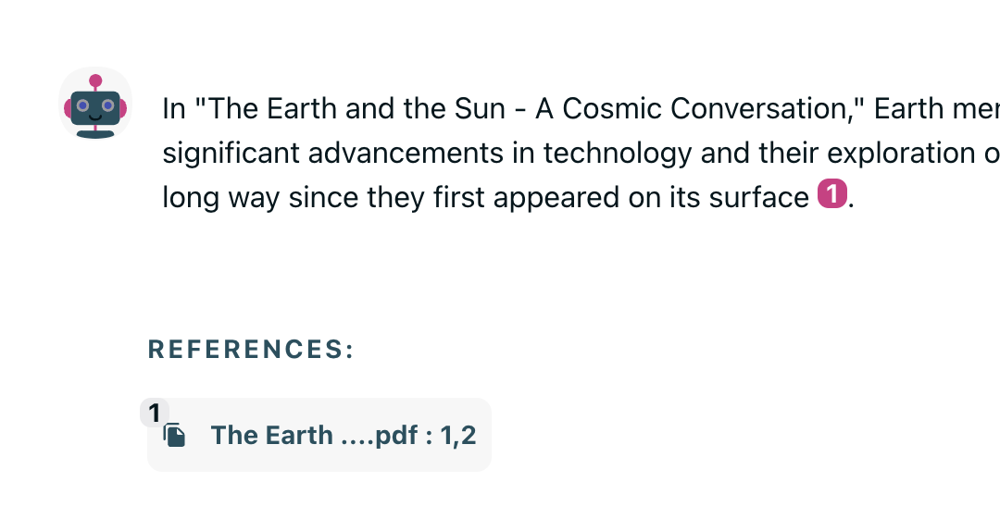

# Hello World of handling context references

This document shows a simple example of how BlueLugia handles context references.

The idea is to create a situation where a source is present in the context, and the assistant is citing it.

BlueLugia is supposed to make sure that the references (links) are correctly generated.

For this exercise, the following steps are taken:

- Upload two files
- Ask a question that requires the assistant to search in one of the uploaded files
- Ensure that the retrieved information is in the context (the tool call returns the XML data)
- Ask a follow-up question that requires the assistant to cite the retrieved information **without making another search**
- Verify that the followup question has a correct reference with correct link

# Uploaded files

I asked ChatGPT to generate two discussions, each of roughly 3000 tokens.

- Between the Sun and the Earth
- Between the Earth and the Moon


# Tools

I added a `SearchInFile` tool in order to allow the LLM to retrieve data from the uploaded files.

We can see that

- The tool returns found data in the file, as XML source string
- The tool truncates the data to 1000 tokens

```python
class SearchInFile(BaseModel):
    """Use this tool to search data in an uploaded file."""

    search: str = Field(..., description="The text to search in the file.")
    file_name: str = Field(..., description="The name of the file to search in.")

    def run(self, call_id: str, state: StateManager, *args):
        return state.files.uploaded.filter(key=self.file_name).search(self.search).truncate(1000).xml()
```

# System prompts

The LLM is prompt with the available **files names** and instructions for citing sources in the correct format.

```python
files_names = ", ".join([file["name"] for file in state.files.uploaded.values("name")])

state.context(
    [
        Message.SYSTEM("Your must always cite your sources using [source0], [source1], [source2], etc."),
        Message.SYSTEM(f"The available uploaded files are: {files_names}"),
    ],
    prepend=True,
).register(SearchInFile).loop(out=state.last_ass_message)
```

# 1 - Generating a tool call that returns a source

The first question aims to make the LLM use the tool in order to find the answer in the uploaded file.
The trick is that we make a tool call return an XML source so that it'll stay in the context (BL saves tools calls in debug info and reconstructs the context accordingly).

NB: The full context is built by BL on module init, but `state.context()` will override it if you don't specify `append=True` or `prepend=True`.

> what does the earth say about humans ?

Here are the logs, showing a tool call in order to retrieve some information from the files

```
  received message      BL::StateManager::context::Inserting 2 messages to the context
  received message      BL::StateManager::register::Registering tool SearchInFile
  
  starting loop         BL::StateManager::loop::Starting completion loop with message None. Max 5 iterations.

       loop 0           Completing iteration 0.
                        BL::StateManager::complete::Message None already in context.
                        BL::StateManager::complete::Filtering context for empty assistant messages without content nor tools.
                        Reformating context messages.
                        Found 49 tokens of system messages.
                        BL::Manager::LLM::complete::NonSystemMessagesTruncatedTo::123855 tokens
                        BL::Model::MessageList::keep::123855 tokens out of 8 tokens along 1 messages.
                        BL::Manager::LLM::complete::MessagesReformatedTo::57 tokens.
                        BL::Manager::LLM::complete::Model::pictet-ptu-gpt-4o
                        BL::StateManager::complete::Appending completion to context: Role.ASSISTANT
                          
       calling tools      BL::StateManager::loop::Calling tools for completion Role.ASSISTANT.
        tool call         BL::StateManager::_call_tools::Calling tools [{'id': 'call_xggbOayimvaGPbjfBFjgaDEU', 'type': 'function', 'function': {'name': 'SearchInFile', 'arguments': {'search': 'humans', 'file_name': 'The Earth and the Sun - A Cosmic Conversation.pdf'}}}]
                          BL::StateManager::_call_tools::0 - Calling tool SearchInFile
                          BL::StateManager::_call_tools::Extra contains tool_calls, loop_iteration, tool_call_index
                          BL::StateManager::_call_tools::Tool SearchInFile is search='humans' file_name='The Earth and the Sun - A Cosmic Conversation.pdf'
                          BL::StateManager::_call_tools::Pre run hook is None
          TOOL RUN        BL::StateManager::_call_tools::Run is <source0><source1><source2>...
                          BL::StateManager::_call_tools::Post run hook is None
                          BL::StateManager::_process_tools_called::Tool run call_xggbOayimvaGPbjfBFjgaDEU of SearchInFile appended to extension.
                          BL::StateManager::_process_tools_called::Extension of 1 tool messages appended to context.
                          BL::StateManager::call::Finished running 1 tools.
                          BL::StateManager::loop::1 Tools called for completion Role.ASSISTANT.
                    
        loop 1          Completing iteration 1.
                        BL::StateManager::complete::Message None already in context.
                        BL::StateManager::complete::Filtering context for empty assistant messages without content nor tools.
                        Reformating context messages.
                        Found 49 tokens of system messages.
                        BL::Manager::LLM::complete::NonSystemMessagesTruncatedTo::123855 tokens
                        BL::Model::MessageList::keep::123855 tokens out of 1356 tokens along 3 messages.
                        BL::Manager::LLM::complete::MessagesReformatedTo::1405 tokens.
                        BL::Manager::LLM::complete::Model::pictet-ptu-gpt-4o
                        BL::StateManager::complete::Appending completion to context: Role.ASSISTANT

    no tool calls         BL::StateManager::loop::Calling tools for completion Role.ASSISTANT.
                          BL::StateManager::_call_tools::Calling tools []
                          BL::StateManager::_process_tools_called::Extension of 0 tool messages appended to context.
                          BL::StateManager::call::Finished running 0 tools.
                          BL::StateManager::loop::0 Tools called for completion Role.ASSISTANT.
```

What happens is (by using state.loop)

- LLM.complete to get a tool call
- STATE.call to run the tool called (its return is the XML source)
- LLM.complete to answer the user (the tool called / source is in the context)

We can see that the assistant answers correctly and the source is cited.



# 2 - Ask for a reference from the existing source

The second questions aims to verify that the assistant is capable of leveraing the source from the previous tool call in order to cite it again.
This time, we don't want any tool call to retrieve new sources, we want the assistant to use the existing one.

> can you provide a sentence from the earth to outline your last answer ?


```
    received message      BL::StateManager::context::Inserting 2 messages to the context
    received message      BL::StateManager::register::Registering tool SearchInFile

      starting loop       BL::StateManager::loop::Starting completion loop with message None. Max 5 iterations.
                          
                          
           loop 0         Completing iteration 0.
                          BL::StateManager::complete::Message None already in context.
                          BL::StateManager::complete::Filtering context for empty assistant messages without content nor tools.
                          Reformating context messages.
                          Found 49 tokens of system messages.
                          BL::Manager::LLM::complete::NonSystemMessagesTruncatedTo::123855 tokens
                          BL::Model::MessageList::keep::123855 tokens out of 1425 tokens along 5 messages.
                          BL::Manager::LLM::complete::MessagesReformatedTo::1474 tokens.
                          BL::Manager::LLM::complete::Model::pictet-ptu-gpt-4o
                          BL::StateManager::complete::Appending completion to context: Role.ASSISTANT

        calling tools       BL::StateManager::loop::Calling tools for completion Role.ASSISTANT.
        NO TOOL CALLS       BL::StateManager::_call_tools::Calling tools []
                            BL::StateManager::_process_tools_called::Extension of 0 tool messages appended to context.
                            BL::StateManager::call::Finished running 0 tools.
                            BL::StateManager::loop::0 Tools called for completion Role.ASSISTANT.
```

We can see that the assistant is able to find an answer AND cite it correctly.


# 3 - Going further with another source

Next question requires to make a new tool call because we ask for chunks that may not be in the previous source.

> what are the last words of the earth to the moon ?

```
... logs ...
BL::StateManager::_call_tools::Calling tools [{'id': 'call_bAWGmjGFpFiQHtDl9QmVnQbE', 'type': 'function', 'function': {'name': 'SearchInFile', 'arguments': {'search': 'last words', 'file_name': 'The Moon and the Earth - A Celestial Dialogue.pdf'}}}]
... logs ...
```

We can see that the citation if from another source (The Moon ... page 6)


# 4 - Wrapping up

Last we try to push the prompt and check that sources and citations are correctly retrieved by the LLM and linked altogether.
No tool calls should be performed, relying only on sources already in context.

> summarize your statements and their sources

```
... logs ...
BL::StateManager::_call_tools::Calling tools []
... logs ...
```

We can verify that the LLM correctly references the two sources from the two files, and for each source, the correct page is cited.
The clickable references are correctly generated.


# Appendix 1 - Code Used

Here is the code used to generate the above example.

```python
from pydantic import BaseModel, Field

from blue_lugia.app import App
from blue_lugia.config import ModuleConfig
from blue_lugia.models import Message
from blue_lugia.state import StateManager


class SearchInFile(BaseModel):
    """Use this tool to search data in an uploaded file."""

    search: str = Field(..., description="The text to search in the file.")
    file_name: str = Field(..., description="The name of the file to search in.")

    def run(self, call_id: str, state: StateManager, *args):
        return state.files.uploaded.filter(key=self.file_name).search(self.search).truncate(1000).xml()


def module(state: StateManager[ModuleConfig]) -> None:

    files_names = ", ".join([file["name"] for file in state.files.uploaded.values("name")])

    state.context(
        [
            Message.SYSTEM("Your must always cite your sources using [source0], [source1], [source2], etc."),
            Message.SYSTEM(f"The available uploaded files are: {files_names}"),
        ],
        prepend=True,
    ).register(SearchInFile).loop(out=state.last_ass_message)


app = App("Petal").threaded(False).of(module).listen()
```

# Appendix 2 - More Advanced Use Cases

```python
class CitedSourcesFromToolMessage(BaseModel):
    """Use this tool to add a tool message that cites sources that won't appear in the context later."""

    search: str = Field(..., description="The text to search in the file.")
    file_name: str = Field(..., description="The name of the file to search in.")

    def run(self, call_id: str, state: StateManager, extra: dict, out: Message, *args) -> Message | None:
        sources = state.files.uploaded.filter(key=self.file_name).search(self.search).truncate(1000)

        state.last_ass_message.append("_Using CitedSourcesFromToolMessage_")

        completion = state.llm.complete(
            completion_name="tool",
            messages=[
                Message.SYSTEM("Your must always cite your sources using [source0], [source1], [source2], etc."),
                Message.SYSTEM("The sources available are:"),
                Message.SYSTEM(sources.xml()),
                Message.USER(self.search),
            ],
        )

        return state.llm.complete(
            completion_name='summarize',
            messages=[
                Message.SYSTEM("Your role is to summarize the user message and keep the cited sources as-is."),
                Message.USER(completion.content, sources=completion.sources),
            ],
        )


class CitedSourcesStreamed(BaseModel):
    """Use this tool to trigger a completion citing sources but without a completion after."""

    search: str = Field(..., description="The text to search in the file.")
    file_name: str = Field(..., description="The name of the file to search in.")

    def run(self, call_id: str, state: StateManager, extra: dict, out: Message, *args) -> bool:
        sources = state.files.uploaded.filter(key=self.file_name).search(self.search).truncate(1000)

        state.last_ass_message.append("_Using CitedSourcesStreamed_")

        state.llm.complete(
            completion_name="tool",
            messages=[
                Message.SYSTEM("Your must always cite your sources using [source0], [source1], [source2], etc."),
                Message.SYSTEM("The sources available are:"),
                Message.SYSTEM(sources.xml()),
                Message.USER(self.search),
            ],
            out=out,
            start_text=out.content or "",
        )

        return False


class XMLSourcesFromToolMessage(BaseModel):
    """Use this tool to read an uploaded file."""

    file_name: str = Field(..., description="The name of the file to read.")

    def run(self, call_id: str, state: StateManager, extra: dict, out: Message, *args) -> str:
        state.last_ass_message.append("_Using XMLSourcesFromToolMessage_")
        return state.files.uploaded.filter(key=self.file_name).first().truncate(3000).xml()


def module(state: StateManager[ModuleConfig]) -> None:
    files_names = ", ".join([file["name"] for file in state.files.uploaded.values("name")])

    state.context(
        [
            Message.SYSTEM("Your role is to help the developer test the management of sources."),
            Message.SYSTEM("Your must always cite your sources using [source0], [source1], [source2], etc."),
            Message.SYSTEM("The sources are provided as XML tages like <source0>, <source1>, <source2>, etc."),
            Message.SYSTEM("You must follow the user instructions to retrieve information in various ways that will introduce sources in the context."),
            Message.SYSTEM(f"The available uploaded files are: {files_names}"),
        ],
        prepend=True,
    ).register([CitedSourcesFromToolMessage, CitedSourcesStreamed, XMLSourcesFromToolMessage]).loop(out=state.last_ass_message, completion_name="root")

    return
```